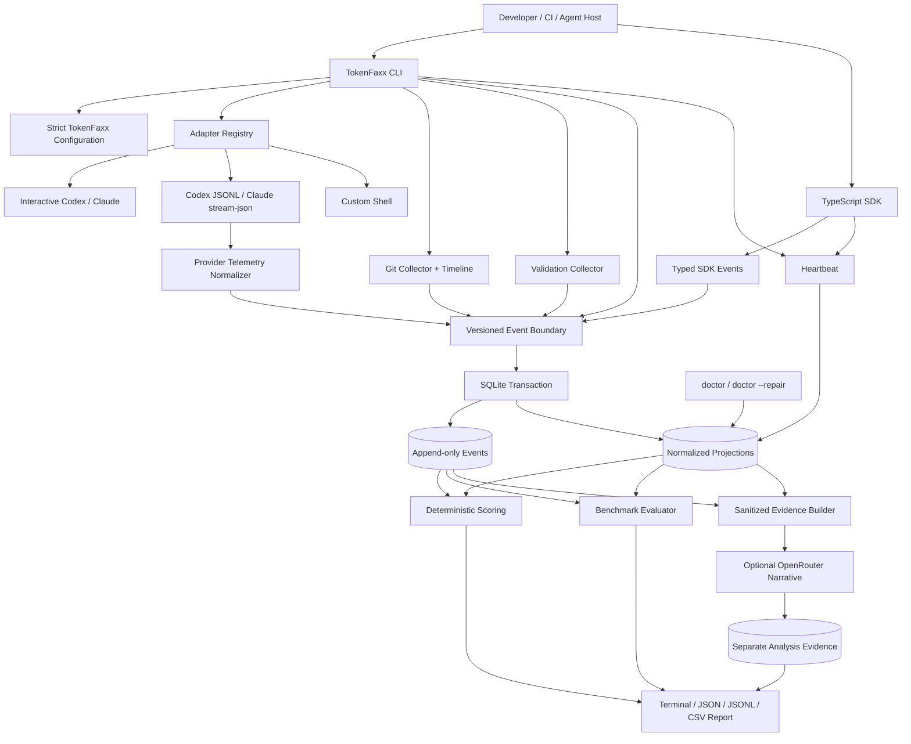

# TokenFaxx interview guide for Atlan AI-Native Builder Intern

> Study guide, whiteboard script, architecture reference, and question bank
>
> Project version: `0.1.0` alpha  
> Audience: the project author preparing for Atlan's AI-Native Builder Intern interview  
> Code reference: this repository after provider telemetry and session-recovery work

## How to use this guide

Do not memorize every sentence. Be able to explain the project in your own words, open the relevant code, and distinguish clearly between:

1. what is implemented;
2. what is measured directly;
3. what is provider-reported;
4. what is calculated;
5. what is inferred;
6. what is still roadmap work.

The strongest interview behavior is not pretending the system is finished. It is showing that you understand its boundaries, can defend the decisions, and know how to improve it.

When an answer below says “I,” use it only if it accurately represents your own work. If AI helped you design or implement parts of the project, explain exactly how you used it, what you personally verified, where you rejected suggestions, and how the test suite gave you confidence. Atlan explicitly values AI-native work, but also judgment and real understanding.

---

# 1. The project in progressively deeper versions

## One sentence

TokenFaxx is a local-first observability and evaluation layer for coding-agent sessions that converts process, Git, validation, model-usage, cost, benchmark, and human-outcome evidence into an explainable confidence-aware report.

## 30-second answer

Coding agents can claim they finished a task, but a successful process exit does not prove that tests passed, the requested change was accepted, or the run was efficient. TokenFaxx wraps Codex, Claude, or a custom command—or accepts direct SDK instrumentation—then records privacy-conscious metadata, Git boundaries, configured validation results, provider-reported usage where available, and explicit outcomes. It stores versioned evidence in local SQLite, calculates a deterministic score only when enough evidence exists, and keeps missing information unavailable instead of treating it as zero.

## Two-minute answer

The problem is that agent evaluation often mixes unrelated questions: Did the process exit? Did validation pass? Was the work accepted? Were the observed changes actually associated with this session? How many tokens and dollars were used? Were two runs given equivalent tasks and starting states?

TokenFaxx models those as separate evidence dimensions. A CLI session establishes a Git and time boundary, starts the selected adapter, samples file metadata, captures official structured provider usage in non-interactive Codex or Claude modes, runs only validations explicitly approved in configuration, stores typed events and normalized projections transactionally, calculates an explainable score, and produces reports. Benchmarks run from detached Git worktrees and hash the definition plus resolved starting commit so comparisons can refuse to claim equivalence when inputs differ.

The design is intentionally local-first. SQLite and privacy-safe defaults make adoption simple and keep source, prompts, responses, diffs, terminal output, and secrets out of storage. Optional OpenRouter analysis can explain sanitized evidence but cannot overwrite deterministic outcomes. The current product is an alpha developer tool, not yet a hosted enterprise platform.

## Why it matters to Atlan

Atlan describes its work as building a trusted context layer for enterprise AI: definitions, lineage, ownership, trust signals, and policy that help agents act without inventing answers. TokenFaxx applies the same principle to coding agents. Raw activity is not enough; an agent needs evidence with provenance, boundaries, confidence, and explicit missing context.

The role specifically calls out:

- context and trust signals for agents and humans;
- integrations with real systems;
- evaluations where a confident wrong answer is worse than no answer;
- developer tooling that compounds team effectiveness;
- building under ambiguity.

TokenFaxx is relevant because its central invariant is: **do not claim more than the evidence supports**.

Sources for interview preparation:

- [Atlan AI-Native Builder Intern role](https://intern.at.atlan.com/)
- [Atlan careers and interview principles](https://atlan.com/careers/)
- [Atlan AI expectations](https://atlan.com/ai-expectations/)
- [Atlan backend internship interview experience](https://blog.atlan.com/team/interview-backend-engineering-internship/)

---

# 2. The problem model

## Questions TokenFaxx keeps separate

| Dimension       | Question                                                  | Evidence source                                           | Important caveat                                                |
| --------------- | --------------------------------------------------------- | --------------------------------------------------------- | --------------------------------------------------------------- |
| Execution       | Did the launched process exit?                            | OS child-process lifecycle                                | Exit `0` is not correctness                                     |
| Validation      | Did configured test/build/lint/typecheck checks pass?     | User-approved commands and exit codes                     | A parser may know fewer details than the exit code              |
| Outcome         | Was the task attempted, validated, accepted, or rejected? | Deterministic provisional status and explicit human input | Merge and acceptance are not the same as correctness            |
| Attribution     | Are observed changes associated with this session?        | Time boundary, Git head, file metadata, commits           | Association is not causation                                    |
| Usage           | What tokens/model did the provider report?                | SDK or official JSON streams                              | Interactive terminal wrappers may have no trustworthy usage API |
| Cost            | What was reported or calculated?                          | Provider response or exact configured price match         | Subscription usage may not map to API billing                   |
| Reproducibility | Were two runs meaningfully comparable?                    | Benchmark hash and resolved commit                        | Same task ID alone is insufficient                              |
| Interpretation  | What does the evidence imply and what is missing?         | Deterministic rules; optional bounded AI narrative        | AI cannot change authoritative evidence                         |

## Product invariants

These are the most important decisions to defend:

- TokenFaxx evaluates a **session**, not a developer.
- Token counts and lines changed are context, not productivity measures.
- Process success, validation, acceptance, and benchmark success are separate.
- Missing data is `null`/Unavailable, never silently zero.
- Observed, provider-reported, calculated, estimated, and inferred values retain different provenance.
- AI analysis cannot alter validation, outcomes, benchmark verdicts, or scores.
- A comparison can decline to select a winner.
- Validation commands are user-controlled code and are not invented or enabled silently.
- Raw prompts, responses, terminal output, source, and diff contents are not stored by default.

---

# 3. What is implemented today

## CLI and lifecycle

Implemented commands include:

- `init`
- `run`
- `sessions`
- `report`
- `mark-outcome`
- `compare`
- `export`
- `delete-session`
- `delete-all-data`
- `doctor`
- `benchmark run`
- `benchmark compare`

`run` launches an adapter, records lifecycle evidence, samples Git metadata, runs configured validations, computes a report, and preserves the child exit code. Signals are forwarded. Custom shell commands use a separate POSIX process group so descendants can be interrupted together.

Active CLI and SDK sessions maintain a heartbeat. `doctor` detects stale running sessions, and `doctor --repair` explicitly finalizes confirmed stale sessions as interrupted. Repair is deliberately opt-in because an old session is not enough proof that no agent process remains.

## Adapters

| Adapter       | Mode                             | Usage evidence                                  | Main purpose                        |
| ------------- | -------------------------------- | ----------------------------------------------- | ----------------------------------- |
| `codex`       | Interactive                      | Unavailable                                     | Preserve normal Codex terminal UX   |
| `claude`      | Interactive                      | Unavailable                                     | Preserve normal Claude terminal UX  |
| `codex-json`  | Non-interactive structured JSONL | Provider-reported                               | Capture official Codex turn usage   |
| `claude-json` | Non-interactive `stream-json`    | Provider-reported                               | Capture Claude usage/model/cost     |
| `custom`      | Reviewed shell command           | Unavailable unless separately instrumented      | Support any local agent executable  |
| SDK           | In-process                       | Exact or provider-reported, as supplied by host | Highest-fidelity custom integration |

Structured adapters deliberately have different names instead of silently changing interactive behavior.

Example:

```bash
tokenfaxx run --agent codex-json --complexity medium -- "Fix notification migration"
tokenfaxx run --agent claude-json --complexity medium -- "Fix notification migration"
```

## Provider telemetry

The telemetry collector:

- accepts JSON one line at a time;
- ignores malformed, primitive, unrelated, and future unknown events;
- accepts only finite non-negative safe integer counters;
- limits pending telemetry lines to one megabyte in the CLI;
- does not persist raw provider JSON;
- keeps the latest Codex cumulative usage snapshot rather than summing snapshots;
- deduplicates Claude assistant usage by stable message ID;
- prefers Claude's final result usage and reported cost when present;
- calculates configured cost only when provider, model, and token fields exactly match user-supplied pricing;
- labels structured values `reported`, not `exact`.

## Git evidence

TokenFaxx records:

- repository name and remote metadata;
- branch and head SHA;
- before/after snapshots;
- status codes;
- changed filenames;
- file sizes and modification times in periodic samples;
- commits observed across the session boundary;
- aggregate line counts where Git makes them available.

It does not store source or diff contents. This protects privacy but weakens causal attribution, especially in dirty working trees or with concurrent editors.

## Validation

Supported categories:

- test;
- build;
- lint;
- typecheck.

Each configured validation has:

- command;
- timeout;
- enabled flag;
- parser;
- optional machine-readable result file.

Validation output is shown live but only a bounded amount is retained in memory for parsing, and raw output is not persisted. Result files are resolved using real paths, must remain regular files inside the validation directory, and are rejected if an absolute/parent path or symlink escapes the boundary or the file exceeds the configured limit.

Exit status is authoritative for pass/fail. Parser details are supporting evidence and may be heuristic.

## Storage and event model

Every session has an append-only typed event history and normalized query tables. For projections performed inside `appendEvent()`, event insertion and projection share one SQLite transaction. Validation rows, Git snapshots, score replacement, and session finalization are separate orchestration writes, so whole-session finalization is not yet one atomic transaction.

Important guarantees:

- Zod validates the envelope and event-specific payload.
- Event IDs are idempotency keys.
- Replaying the same event ID and canonical content is a no-op.
- Reusing an event ID with different content is rejected.
- Session agent/repository/task context must match the event.
- A projection failure rolls back the raw event.
- Session completion is idempotent for the same result.
- Conflicting or concurrent finalization is rejected.

Normalized tables make reports straightforward; events preserve provenance and enable future re-projection.

## Scoring and confidence

Default score weights:

| Component              | Weight |
| ---------------------- | -----: |
| Outcome                |    30% |
| Validation quality     |    25% |
| Token efficiency       |    15% |
| Cost efficiency        |    10% |
| Rework estimate        |    10% |
| Attribution confidence |    10% |

Rules:

- Missing components are excluded from the available-weight denominator.
- A failed cheap run cannot win through efficiency.
- Token efficiency needs a successful outcome, reported/calculated usage, and explicit task complexity.
- Estimated usage does not affect efficiency.
- Cost efficiency needs a successful outcome and explicit maximum cost.
- A final score is withheld if essential outcome and quality/attribution evidence is absent.
- Confidence is reported separately from score.

The token baselines are transparent heuristics, not scientifically calibrated productivity standards. This is an explicit alpha limitation.

## Benchmarks

A benchmark definition specifies:

- task identity and description;
- repository;
- starting commit;
- optional setup command;
- a `timeoutMs` currently applied to setup and validation commands;
- validation commands;
- expected validation outcomes;
- optional maximum cost and tags.

Lifecycle:

1. Require a clean primary repository.
2. Resolve the starting revision to an immutable commit.
3. Normalize and hash the definition plus resolved commit.
4. Create a detached worktree.
5. Run optional setup.
6. Run the agent.
7. Run only validations from the hashed benchmark definition.
8. Classify every expectation as met, unmet, or missing.
9. Store a deterministic benchmark event.
10. Remove successful worktrees and preserve failed ones for debugging.

The tool refuses a confident comparison when definition hashes or starting commits differ.

## AI features

AI is used in two bounded roles:

1. Optional task profiling from an explicitly supplied task description.
2. Optional report narrative from a sanitized evidence bundle.

AI cannot:

- mark validation passed;
- declare code correct;
- infer human acceptance;
- invent token usage;
- overwrite scores or benchmark results.

Narrative anomalies must cite transmitted event IDs. Unknown citations are rejected.

## Privacy and security

Defaults do not store:

- prompts;
- responses;
- source;
- diff contents;
- terminal output;
- environment values;
- API keys.

Additional controls:

- `.tokenfaxx` directory attempts mode `0700`;
- database attempts mode `0600`;
- common secret-bearing environment variable names are removed from child and validation environments;
- SDK payloads recursively redact secret-looking keys;
- OpenRouter is disabled by default;
- result-file containment is enforced;
- retention and deletion commands exist;
- orphan project rows are removed during deletion/retention;
- TypeScript configuration is not executed by `doctor` unless `--execute-config` is explicitly supplied.

Task descriptions, repository paths, filenames, validation commands, outcome reasons/evidence, and other metadata are stored locally and can appear in exports; they can still be sensitive. SDK redaction is primarily based on credential-like key names and cannot guarantee detection of a secret embedded in an innocently named value.

Honest limitation: executable configuration and user-approved shell validation commands still run with user privileges. The system reduces accidental exposure; it is not a sandbox for malicious repositories.

---

# 4. Detailed architecture

## High-level architecture



## Whiteboard version to draw in an interview

Draw five horizontal layers:

```text
+-----------------------------------------------------------------------+
| 1. ENTRY POINTS                                                       |
| CLI run / benchmark / report                    TypeScript SDK        |
+---------------------------+-------------------------------------------+
                            |
+---------------------------v-------------------------------------------+
| 2. OBSERVATION + INTEGRATION                                          |
| adapters | structured telemetry | Git timeline | validation commands |
+---------------------------+-------------------------------------------+
                            |
+---------------------------v-------------------------------------------+
| 3. TRUST BOUNDARY                                                     |
| Zod event validation | provenance | canonical JSON | idempotency      |
+---------------------------+-------------------------------------------+
                            |
+---------------------------v-------------------------------------------+
| 4. LOCAL EVIDENCE STORE                                               |
| SQLite transaction: append-only event + normalized projection        |
+---------------------------+-------------------------------------------+
                            |
+---------------------------v-------------------------------------------+
| 5. DECISION + PRESENTATION                                            |
| deterministic scoring | benchmark verdict | report | optional AI text|
+-----------------------------------------------------------------------+
```

On the side, draw two cross-cutting concerns:

```text
PRIVACY: no raw source/prompts/output by default; local-first; redaction
RELIABILITY: transactions; heartbeats; recovery; timeouts; strict schemas
```

## Package dependency map

```text
                    +-------------------+
                    | apps/cli          |
                    | orchestration     |
                    +---------+---------+
                              |
       +----------------------+----------------------+
       |          |            |          |          |
       v          v            v          v          v
  adapters    collectors    storage    scoring    analysis
       |          |            |          |          |
       +----------+------------+----------+----------+
                              |
                              v
                         core contracts
                              |
                              v
                        shared utilities

  sdk ---------------------> core + storage + shared
```

Package responsibilities:

- `packages/core`: schemas, configuration, event contracts, pricing, benchmarks, evidence types.
- `packages/shared`: IDs, timestamps, canonicalization/redaction utilities.
- `packages/storage`: SQLite lifecycle, migrations, event projection, queries, retention.
- `packages/collectors`: Git and validation observation.
- `packages/adapters`: launch specifications, capabilities, provider telemetry normalization.
- `packages/scoring`: pure deterministic evaluation.
- `packages/analysis`: optional OpenRouter calls and structured narrative validation.
- `packages/sdk`: in-process instrumentation API.
- `apps/cli`: orchestration and user-facing commands.

The direction keeps domain contracts below integration code. The scoring package does not launch processes or query a database, which makes it testable as a pure function.

## End-to-end session sequence

```mermaid
sequenceDiagram
    actor User
    participant CLI
    participant Adapter
    participant Git
    participant Provider
    participant DB as SQLite
    participant Validator
    participant Score

    User->>CLI: tokenfaxx run ...
    CLI->>CLI: load strict config
    CLI->>Git: repository info + before snapshot
    CLI->>DB: create running session
    CLI->>DB: session.started + before evidence
    CLI->>DB: periodic heartbeat
    CLI->>Adapter: build launch specification
    Adapter->>Provider: launch interactive or structured process

    loop while process runs
        CLI->>Git: metadata sample
        Git->>DB: git.sampled
        Provider-->>CLI: structured usage event (JSON mode only)
        CLI->>CLI: normalize/dedupe; do not persist raw line
    end

    Provider-->>CLI: process exit
    CLI->>DB: command.completed
    CLI->>DB: normalized model.usage if available

    loop configured validations
        CLI->>Validator: run approved command with timeout
        Validator-->>CLI: exit + bounded parser details
        CLI->>DB: validation evidence
    end

    CLI->>Git: after snapshot + compare
    CLI->>DB: commit/file/outcome/completion events
    CLI->>DB: conditionally finalize normalized session row
    CLI->>Score: evaluate bundle
    Score-->>DB: score snapshot
    CLI-->>User: explainable report
```

## Event write transaction

```text
appendEvent(input)
      |
      v
parse envelope + payload with Zod
      |
      v
verify owning session context
      |
      v
canonicalize payload and metadata
      |
      +--> existing same ID + same content? return original (idempotent)
      |
      +--> existing same ID + different content? reject conflict
      |
      v
BEGIN SQLITE TRANSACTION
      |
      +--> INSERT event
      |
      +--> INSERT normalized projection for recognized event
      |
      +--> projection error? ROLLBACK both
      |
      v
COMMIT
```

## Structured telemetry normalization

```text
provider stdout chunk
       |
       v
bounded line framing (max pending line: 1 MB)
       |
       v
JSON.parse in defensive collector
       |
       +--> malformed / primitive / unknown event: ignore
       |
       +--> unsafe numeric value: keep field unavailable
       |
       v
provider-specific normalization
       |
       +--> Codex: replace with latest cumulative turn snapshot
       |
       +--> Claude: dedupe assistant IDs; final result overrides fallback
       |
       v
provider-neutral usage snapshot
       |
       +--> provider-reported cost present: preserve it
       |
       +--> cost absent + exact pricing match: calculate with provenance
       |
       v
one typed model.usage event
```

---

# 5. Architectural decisions, alternatives, and trade-offs

## Why local-first?

**Decision:** Store evidence in a repository-local SQLite database by default.

**Why:** The first users are individual developers. Local storage lowers setup friction, works offline, avoids sending sensitive repository metadata to a new service, and makes privacy claims easier to defend.

**Alternative:** Hosted ingestion from day one.

**Why not initially:** It immediately requires authentication, tenancy, encryption, retention policy, authorization, operational monitoring, billing, and a stronger threat model before proving that the core evidence is useful.

**Trade-off:** Collaboration, centralized trends, and cross-machine sessions are harder. SQLite is not the final architecture for a multi-tenant product.

## Why SQLite instead of JSON files?

**Decision:** SQLite with foreign keys and WAL.

**Why:** Transactions prevent event/projection divergence, relational queries simplify reports, indexes support filtering, and one file remains operationally simple.

**Alternative:** JSONL-only append log.

**Trade-off:** JSONL is simple and inspectable but requires re-scanning or a separate index for every report. SQLite adds a native dependency and migration responsibility.

## Why both events and normalized tables?

**Decision:** Keep an event history and query-friendly projections.

**Why:** Events preserve source and chronology. Projections make reports and aggregates simple. This is a lightweight event-sourced shape without making every read replay the entire history.

**Trade-off:** Two representations can diverge. TokenFaxx addresses that by writing them in the same transaction and testing rollback behavior.

## Why Zod at the event boundary?

**Decision:** Runtime validation before storage.

**Why:** TypeScript types disappear at runtime. Provider streams, SDK callers, configuration files, and migrated data are untrusted inputs. Zod provides discriminated validation and useful errors.

**Trade-off:** Runtime overhead and schema maintenance. For local session volumes, correctness is worth more than micro-optimization.

## Why deterministic scoring?

**Decision:** Scoring is pure rules, not an LLM judgment.

**Why:** Users must reconstruct why a report said what it said. Deterministic inputs and weights are auditable, testable, and stable.

**Alternative:** Ask a model whether the implementation is good.

**Why not:** The model can hallucinate, be prompt-injected by evidence, drift across versions, and cannot prove tests or human acceptance.

**Trade-off:** Rules are less flexible and require calibration. TokenFaxx therefore presents confidence and limitations rather than pretending the score is universal truth.

## Why allow scores to be unavailable?

**Decision:** Withhold a score when essential evidence is missing.

**Why:** “No measurement” and “zero performance” are different facts. Converting missing token usage to zero would incorrectly reward a run. Returning `null` is safer than false precision.

**Trade-off:** Reports may feel less satisfying. The product chooses trust over always showing a number.

## Why separate score and confidence?

A high result from weak evidence is not equivalent to a high result from strong evidence. Score describes evaluated performance under available components. Confidence describes how complete and attributable the evidence is.

## Why separate interactive and structured adapters?

**Decision:** `codex`/`claude` remain interactive; `codex-json`/`claude-json` are explicit non-interactive modes.

**Why:** Structured flags can change prompts, stdin behavior, color, and output. Silently adding them would break established UX and scripts.

**Trade-off:** More adapter names and documentation. The explicitness makes capability and provenance honest.

## Why not scrape terminal output?

Decorative TUI output is not a stable API. It changes between versions, may be localized, and may display cumulative values ambiguously. Structured official output or SDK callbacks are stronger evidence.

## Why provider-reported instead of exact?

TokenFaxx did not count tokenizer input itself. It received counters from the provider's supported interface. “Provider-reported” accurately describes provenance without claiming independent verification.

## Why keep the latest Codex snapshot?

Codex turn usage may be cumulative. Summing repeated snapshots would double count. Keeping the latest recognized snapshot is conservative for one invocation. If future events become clearly per-turn rather than cumulative, the adapter contract should version that semantic.

## Why deduplicate Claude by message ID?

Streaming protocols can replay or repeat assistant message records. A stable message ID is a safer aggregation key than arrival count. A final result is preferred because it is the provider's authoritative session summary.

## Why execute validations through a shell?

It supports real project commands and pipelines with minimal configuration.

**Trade-off:** Shell execution is a security boundary. Commands run with user privileges. TokenFaxx requires explicit configuration, strips common credential variables, adds timeouts, and documents that the repository and commands must be trusted. A safer future mode would use argv arrays and sandboxing.

## Why metadata-only Git sampling?

It detects file-state transitions and supports attribution/rework evidence without storing source. The trade-off is that some edits to already-dirty files may be hard to distinguish and attribution remains association, not proof.

## Why heartbeat-based recovery?

A session's age alone does not mean it crashed; agent runs can be long. Periodic heartbeats provide liveness evidence. Repair remains explicit because a paused or partitioned process can create ambiguity.

## Why not execute TypeScript config in `doctor` by default?

A diagnostic command should not unexpectedly execute repository code. The user can opt in with `--execute-config` after trust is established.

## Why optional AI narrative?

AI is valuable for compressing many evidence points into an explanation and suggesting missing checks. It is not authoritative. Keeping it separate lets deterministic reports work offline and preserves trust when the model fails.

## Why OpenRouter?

It provides a single configurable interface to multiple models, which is useful for experimentation. The trade-offs are another external dependency, provider routing policies, model variance, and post-response rather than guaranteed pre-spend cost checks.

## Why a monorepo?

The project has related packages with clear boundaries but one release cadence. A pnpm/Turbo monorepo allows shared TypeScript settings, dependency-aware builds, focused tests, and future independent publication.

## Why not microservices?

The current workload is one local process and one local database. Microservices would add network failure, deployment, authentication, observability, and schema coordination without solving a validated user problem.

---

# 6. Reliability and failure analysis

## Failure matrix

| Failure                        | Current behavior                                  | Why                                                 |
| ------------------------------ | ------------------------------------------------- | --------------------------------------------------- |
| Agent exits non-zero           | Records failed command/session/outcome            | Preserve process authority                          |
| User sends SIGINT/SIGTERM      | Forwards signal, marks interrupted, returns `130` | Match shell conventions                             |
| Host is killed                 | Heartbeat expires; doctor reports it              | Host cannot finalize after SIGKILL                  |
| User confirms stale repair     | Recovery events + interrupted finalization        | Preserve audit trail                                |
| Validation times out           | Terminate, then kill if needed; mark timed-out    | Avoid hung evaluation                               |
| Result file escapes repository | Reject as unsafe/unreadable                       | Prevent symlink/path boundary bypass                |
| Provider JSON malformed        | Ignore telemetry record; session continues        | Observability failure should not erase agent result |
| Provider usage absent          | Show Unavailable                                  | Never fabricate usage                               |
| Event projection fails         | Roll back event and projection                    | Prevent split-brain evidence                        |
| Duplicate event delivery       | Same content is no-op                             | Safe retries                                        |
| Conflicting event ID           | Reject                                            | Idempotency key cannot mean two facts               |
| Duplicate same completion      | No-op                                             | Safe caller retry                                   |
| Conflicting completion         | Reject                                            | Terminal state must be stable                       |
| OpenRouter analysis fails      | Deterministic report remains                      | AI is optional                                      |
| Benchmark setup fails          | Persist failure and preserve worktree             | Avoid launching agent or losing evidence            |
| Benchmark evidence missing     | Expectation is `missing`, not false observation   | Absence is not failure evidence                     |

## Concurrency

SQLite uses WAL and a five-second busy timeout. Session finalization uses a conditional update under a transaction so two finalizers cannot overwrite each other silently.

This is enough for a local developer tool, not for high-write multi-process ingestion. A hosted design would use authenticated ingestion, durable queues, idempotent consumers, and Postgres.

## Important consistency gaps to explain honestly

The event transaction is strong, but the entire session is not committed as one unit:

- a validation row and its validation event are separate writes;
- a completion event and the normalized session-row transition are separate writes;
- before/after Git snapshots are separate writes;
- score replacement deletes and inserts separately;
- stale repair emits recovery events and then finalizes the row rather than using one encompassing transaction.

A crash between those steps can leave partial lifecycle evidence. The production fix is an application-level unit of work for each lifecycle transition, conditional state changes, recovery reconciliation, and crash-injection tests at every write boundary.

## Known benchmark defects and limitations

- `timeoutMs` bounds setup, the coding-agent child process, and validation commands; timed-out agents are terminated and recorded with exit code 124.
- Worktree checkout uses the same resolved SHA included in the benchmark hash, avoiding mutable ref resolution races.
- Custom benchmarks use `--command` instead of combining `--agent custom` with `--command`.
- Setup failure is persisted as a failed session and deterministic failed benchmark verdict without launching the coding agent.
- `benchmark compare` lists matching task IDs; it is not yet a verified statistical cohort comparison.

The final item remains a good example to discuss when asked about limitations or what you would fix next.

## Migration strategy

Current migrations are embedded and additive, with a migration version table and column checks. The heartbeat schema is migration version 4.

Honest limitation: production-grade migration management should move to ordered immutable files with checksums, upgrade/downgrade policy, backup instructions, and fixtures from every supported historical version.

---

# 7. Accuracy model

## Evidence taxonomy

- **Observed:** TokenFaxx directly saw an OS exit, Git state, timestamp, or validation process.
- **Provider-reported:** An official provider interface supplied model, tokens, or cost.
- **Calculated:** TokenFaxx applied an explicit formula to measured inputs and versioned/user-supplied pricing.
- **Estimated:** A heuristic parser or metadata rule approximated a value.
- **Inferred:** An AI or rule classified a task from indirect evidence.
- **Human-reported:** A user explicitly marked acceptance or rejection.

## What “accurate” means here

Accuracy does not mean every value is perfect. It means:

- every fact has a source;
- measurement and inference are not confused;
- missing values remain missing;
- calculations identify their inputs;
- comparisons enforce equivalence or decline;
- confidence and limitations are visible;
- deterministic authority is not overwritten by narrative AI.

## Known accuracy limitations

- Provider streams can change shape; parser fixtures must evolve.
- Codex cumulative semantics are handled conservatively but need versioned provider-contract tests.
- Claude cache creation tokens are not represented as a separate projected field.
- Git metadata cannot prove who caused a concurrent edit.
- Dirty-tree edits and commits can complicate line attribution.
- Human-readable validation parsers are heuristic.
- Coverage is not fully populated.
- Fixed token baselines are not calibrated across languages, models, and task families.
- First-party PR/CI/review/merge outcomes are not integrated yet.

## How to improve accuracy scientifically

1. Define frozen benchmark cohorts by task type, language, repository, starting commit, and validation depth.
2. Run repeated trials per model/configuration.
3. Publish sample size, variance, and failure categories.
4. Version formulas and baselines.
5. Compare predicted quality/confidence with later human acceptance and regression outcomes.
6. Recalibrate without rewriting historical score snapshots.

---

# 8. Security and threat-model questions

## Main trust boundaries

```text
Untrusted or semi-trusted inputs:
- repository files
- executable TypeScript config
- validation commands
- custom shell command
- provider JSONL
- SDK payloads
- OpenRouter model response

Boundaries:
- strict config/event schemas
- explicit command opt-in
- child environment filtering
- result-file path containment
- JSON telemetry normalization
- event/session context checks
- sanitized outbound schemas
- citation validation
- local file permissions
```

## Threats still requiring work

- A trusted TypeScript config can execute arbitrary code during normal commands.
- Shell validators are not sandboxed.
- Name-based environment filtering cannot detect every secret or secrets embedded in allowed values.
- SDK redaction primarily recognizes sensitive keys, not all secret-like values.
- SQLite sidecars, backups, and deleted pages need a documented secure-purge model.
- Supply-chain risk exists through native and npm dependencies.
- OpenRouter sanitization needs ongoing regression and prompt-injection tests.
- A hosted version would require tenant isolation, RBAC, audit logs, encryption, and abuse controls.

A strong answer is: “I designed privacy-safe defaults, but I would not claim this is a hostile-code sandbox.”

---

# 9. Testing and engineering quality

## Test categories in the repository

- configuration validation;
- event schema validation;
- pricing calculations;
- benchmark hashing and expectations;
- storage initialization/migration;
- cascade deletion and retention behavior;
- event idempotency and conflict rejection;
- event/session context checks;
- atomic projection rollback;
- SQLite busy timeout;
- session completion idempotency;
- heartbeat stale-session queries;
- validation failure/timeout/parsing;
- result-file path and symlink escape;
- telemetry parsing and deduplication;
- fake Codex JSONL CLI integration;
- SDK usage/cost behavior;
- scoring withholding and estimated-usage exclusion;
- OpenRouter output validation;
- CLI interruption lifecycle;
- report/CSV behavior;
- package clean-install verification.

## Verification commands

```bash
pnpm typecheck
pnpm test
pnpm lint
pnpm build
pnpm --filter tokenfaxx package:check
```

Current `lint` is TypeScript validation rather than ESLint. Be honest about that. Adding a true linter is useful but less important than correctness and integration tests.

## Most important tests to explain

1. **Atomic projection rollback:** a trigger forces projection failure; the raw event must also disappear.
2. **Event idempotency:** same event ID and canonical content is safe; conflicting content fails.
3. **Result-file symlink escape:** a symlink inside the repository pointing outside is rejected after `realpath`.
4. **Usage deduplication:** repeated cumulative provider snapshots are not summed.
5. **Interrupted child process:** the session becomes interrupted and the CLI returns `130`.
6. **Insufficient evidence:** scoring returns `null` rather than false precision.

---

# 10. Demo plan

## Five-minute interview demo

### Preparation

```bash
pnpm install --frozen-lockfile
pnpm build
cd apps/cli
npm link
cd ../..
tokenfaxx --version
```

Use a small clean Git repository with reviewed validation commands. Do not depend on OpenRouter for the core demo.

### Script

1. Show `tokenfaxx.config.ts` and explain explicit validation opt-in.
2. Run a safe custom session:

```bash
tokenfaxx run \
  --command "node -e \"console.log('agent simulation')\"" \
  --task-id DEMO-1 \
  --task "Demonstrate evidence collection" \
  --task-type investigation \
  --complexity small
```

3. Point out separate sections for process, outcome, validation, Git, usage, confidence, and missing evidence.
4. Show JSON output:

```bash
tokenfaxx report --format json
```

5. Show sessions and explain retention/deletion:

```bash
tokenfaxx sessions
tokenfaxx doctor
```

6. If Codex or Claude is authenticated, optionally show structured usage:

```bash
tokenfaxx run --agent codex-json --complexity small -- "Explain this repository"
```

7. Close with one limitation and next step: “This captures provider-reported usage, but calibrated cohorts and GitHub outcomes are still needed before making comparative claims.”

## Whiteboard explanation order

1. Start from the user question: “Can I trust this agent run?”
2. Draw entry points.
3. Draw observation/integration layer.
4. Draw typed event boundary.
5. Draw SQLite events plus projections.
6. Draw deterministic score/report.
7. Add optional AI off to the side, not in the authority path.
8. Add privacy and reliability as cross-cutting concerns.
9. Explain one failure path and one trade-off.

---

# 11. Atlan interview alignment

## What Atlan says it values

Based on the role and careers material:

- builder at heart;
- AI-native by default;
- bias toward action;
- collaboration;
- first-principles clarity;
- agency and ownership;
- high standards with low ego;
- honest self-awareness;
- systems that create leverage for others.

## How TokenFaxx demonstrates those themes

| Atlan theme             | TokenFaxx example                                                                                 |
| ----------------------- | ------------------------------------------------------------------------------------------------- |
| Trusted context         | Evidence has provenance, confidence, and missing fields                                           |
| Agent reliability/evals | Validation, benchmarks, deterministic verdicts                                                    |
| Integrations            | CLI adapters, provider JSON streams, SDK, Git, validators                                         |
| Developer tooling       | One CLI turns fragmented signals into a reusable report                                           |
| AI-native building      | AI assists development and optional interpretation, while tests and judgment remain authoritative |
| First principles        | Exit success, correctness, acceptance, cost, and attribution are decomposed                       |
| Bias to action          | Local-first MVP avoids waiting for full cloud infrastructure                                      |
| Ownership               | Security/privacy/recovery gaps are surfaced and fixed rather than hidden                          |
| Low ego                 | Comparisons can refuse a winner; limitations are explicit                                         |
| Compounding systems     | Typed events and package boundaries support new adapters and consumers                            |

## Suggested “Why Atlan?” answer

“Atlan is working on the context and trust layer that lets enterprise AI act on governed data. What attracts me is that the role is not only about calling a model; it includes semantics, integrations, reliability, evals, and developer platforms. TokenFaxx pushed me toward the same principle: a capable agent is not useful if humans cannot reconstruct what it observed, what it did, and how confident they should be. I want to work where those trust and context questions exist at enterprise scale, with real integrations and customers, while continuing to build AI-native tooling.”

Do not make the answer generic. Add one concrete Atlan product or engineering detail you researched.

---

# 12. Likely intro-call questions and answers

## 1. Tell me about yourself.

**Suggested structure:** present → evidence → motivation.

“I am a builder focused on developer tooling and reliable AI systems. Most recently I built TokenFaxx, a local-first observability and evaluation layer for coding agents. The interesting part was not simply wrapping an agent process; it was designing evidence boundaries so process exit, validation, usage, attribution, and human outcome were not collapsed into one misleading score. I worked across TypeScript, CLI orchestration, SQLite, Git, provider JSON streams, testing, privacy, and documentation. I am now looking for an environment like Atlan where context, integrations, evals, and reliability are core product problems rather than side features.”

## 2. Why did you choose this problem?

“While using coding agents, I could inspect a final diff but could not answer consistently whether the agent ran the expected checks, what provider usage it consumed, whether the changes belonged to that session, or whether a comparison was fair. I chose the problem because agent capability was improving faster than the trust and evaluation layer around it.”

## 3. What did you personally build?

Give a truthful list. Good categories are:

- problem definition and evidence model;
- package architecture;
- CLI lifecycle;
- storage/event projections;
- provider telemetry normalization;
- scoring rules;
- privacy boundaries;
- benchmark semantics;
- tests and documentation.

If AI generated drafts, say which decisions and verification were yours. Never claim code you cannot explain.

## 4. What was the hardest part?

“The hardest part was deciding what not to claim. For example, interactive CLI output might display token numbers, but scraping it would be fragile. I kept usage unavailable in interactive mode and added explicit structured adapters using official JSON streams. Similarly, Git activity is association evidence, not proof that the agent caused every change. The challenge was turning uncertainty into an explicit data model rather than hiding it.”

## 5. What are you most proud of?

“I am proud that the system can refuse false precision. Missing usage stays unavailable, a score can be withheld, AI cannot override deterministic checks, and benchmark comparisons can refuse a winner when starting conditions differ.”

## 6. What would you do differently?

“I would introduce immutable migration files and provider-contract fixtures earlier. The embedded additive migrations are acceptable for an alpha, but versioned migration artifacts and golden telemetry fixtures would reduce future compatibility risk.”

---

# 13. Technical deep-dive questions and answers

## 7. Walk me through one session end to end.

Use the sequence diagram. Mention configuration, Git boundary, session/event creation, heartbeat, adapter launch, telemetry normalization, validation, final Git comparison, outcome, conditional row finalization, scoring, and reporting. Also state that these lifecycle writes are not yet one end-to-end transaction.

## 8. Why is exit code zero insufficient?

“It proves only that the process terminated successfully according to the operating system. An interactive agent can exit zero without modifying the right file or running any test. TokenFaxx records process success separately from validation and task outcome.”

## 9. Why use events?

“Events preserve chronology and provenance, support idempotent delivery, and leave an audit trail. Normalized tables make common reports efficient. Writing both transactionally avoids a raw-log/projection split.”

## 10. How do you guarantee idempotency?

“Each event has a UUID. Before insertion, the system canonicalizes payload and metadata. The same ID with the same complete logical content returns the original event; the same ID with different session, type, timestamp, payload, or metadata raises an `EVENT_ID_CONFLICT`.”

## 11. What if projection insertion fails?

“Event and projection writes share one SQLite transaction. The test suite creates a trigger that aborts projection insertion and verifies that the raw event is rolled back too.”

## 12. Why SQLite WAL?

“WAL improves local read/write concurrency while retaining one-file operational simplicity. A busy timeout handles short writer contention. It is appropriate for a local single-user product, not the final multi-tenant architecture.”

## 13. How do you handle two processes completing a session?

“Completion reads and conditionally updates inside a transaction with `WHERE status = 'running'`. An identical repeated completion is a no-op; a conflicting or concurrent terminal transition is rejected.”

## 14. How does crash recovery work?

“CLI and SDK sessions update a heartbeat every ten seconds. Doctor uses a conservative stale threshold and reports old running sessions. Repair requires an explicit flag and writes recovery evidence before marking the session interrupted. I avoid auto-repair because a stale heartbeat does not mathematically prove the process is dead.”

## 15. How do Codex tokens work?

“The structured adapter launches `codex exec --json`. It reads line-delimited JSON without storing the raw lines and recognizes supported turn-completion or token-usage shapes. Since usage can be cumulative, it keeps the latest snapshot rather than summing every event.”

## 16. How do Claude tokens work?

“The adapter launches print mode with `stream-json`. It deduplicates fallback assistant usage by message ID and prefers a final result usage object and provider-reported cost when present.”

## 17. Why are those tokens not labeled exact?

“They are authoritative from the integration perspective but not independently counted by TokenFaxx. The correct provenance is provider-reported.”

## 18. How do you avoid parser breakage?

“The parser is defensive: plain objects only, known event types only, safe non-negative integers only, unknown keys ignored, malformed JSON ignored, and bounded line buffering. Unit tests cover known shapes, repeats, malformed lines, and future unrelated events. The next improvement is versioned golden fixtures against provider releases.”

## 19. How is cost calculated?

“A provider-reported cost is never overwritten. If cost is missing, TokenFaxx can calculate it only when provider, model, and token fields exactly match user-configured pricing. The stored result includes measurement type, source, and effective date.”

## 20. Explain score normalization.

“Each available component is normalized to 0–100 and multiplied by its configured weight. Missing components do not become zero; they are excluded from available weight. The contribution total is divided by available weight. Essential-evidence gates can still withhold the final score.”

## 21. Can a cheap failed run win?

“No. Token and cost efficiency are unavailable unless the outcome meets the successful threshold. Estimated usage is also excluded.”

## 22. Is the score scientifically valid?

“Not yet as a universal benchmark. The formulas are deterministic and internally accurate, but token baselines are heuristic. I would calibrate them through repeated frozen cohorts and version the formula before making broad model or team claims.”

## 23. How is confidence calculated?

“It combines data completeness, attribution, outcome confidence, and usage accuracy. It is intentionally distinct from final score so a good-looking result with weak evidence does not appear equally trustworthy.”

## 24. What does attribution confidence mean?

“It estimates how strongly observed repository activity is associated with the session boundary using repository state, commits, validations, and timeline evidence. It explicitly does not claim causation.”

## 25. How do benchmarks ensure reproducibility?

“They resolve a starting commit, normalize and hash the definition plus that commit, use a detached worktree, run only commands included in the hashed definition, and classify every expected result. Comparison confidence is strongest only when definition hash and starting commit match.”

## 26. Why preserve failed worktrees?

“They are debugging artifacts. Removing them would destroy the exact failure state; successful worktrees are cleaned up to avoid clutter.”

## 27. Why is a missing benchmark validation not failure?

“The system distinguishes an observed failed check from absence of evidence. The expectation verdict can still fail overall, but its reason is `missing`, which is more accurate and actionable.”

## 28. How do you protect result files?

“After the validator finishes, the path is resolved through `realpath`. The final target must be a regular file within the validation working directory and below the configured size. Parent paths, absolute escapes, and symlink escapes are rejected.”

## 29. What is the largest security gap?

“Normal commands can intentionally execute a reviewed TypeScript config and shell validators with user privileges. I would add data-only JSON configuration, argv-based commands, and a sandbox/policy layer before treating untrusted repositories as safe.”

## 30. Why filter environment variables?

“Agents and repository validation scripts should not automatically inherit common API keys and credentials. Name-based filtering reduces accidental exposure. It is defense in depth, not a complete secret-management system.”

## 31. Why does doctor not load config by default?

“A diagnostic should be safe to run before repository trust is established. Executing a TypeScript config violates that expectation, so it requires `--execute-config`.”

## 32. How is optional AI analysis protected?

“The evidence builder removes paths, task descriptions, free-form commands/errors, and source-like values; filenames are aliased; validation fields use an allowlist; the model must return structured output; anomaly citations must reference transmitted event IDs; and the analysis is stored separately.”

## 33. What happens if OpenRouter fails?

“The deterministic session remains complete and reportable. AI failure is an unavailable optional interpretation, not a failed engineering result.”

## 34. Why not let AI decide whether the code is correct?

“Correctness needs executable checks and human/product outcomes. An LLM judgment can be useful as a hypothesis but is not authoritative evidence.”

## 35. How would you scale the system?

“I would keep the event contract and replace direct local writes with authenticated ingestion. Events would enter a durable queue, idempotent workers would validate and project into Postgres, large artifacts would go to object storage, and a query/API layer would enforce tenant RBAC. Scoring would be versioned and reproducible. I would retain a local collector for privacy and offline buffering.”

## 36. What consistency model would you use in the hosted version?

“Per-session event ingestion should be idempotent and at-least-once. Projection can be eventually consistent, but terminal benchmark verdict creation should use a transaction or compare-and-set on session state. Every API response should expose projection freshness.”

## 37. How would you handle schema evolution?

“Version event schemas, keep old decoders/upcasters, publish compatibility rules, use immutable database migrations with checksums, and replay fixtures from every supported version. Never silently store unknown malformed events.”

## 38. How would you integrate GitHub?

“A read-only GitHub App would enrich a session with PR, CI, review, merge, revert, and later-regression events. Each value would retain source URL/time and installation identity. Merge would be acceptance evidence, not proof of correctness.”

## 39. How would you add a new provider?

“Implement `AgentAdapter`, declare honest capabilities, add structured telemetry normalization if an official interface exists, register it, create synthetic/golden fixtures, and prove unknown provider events fail open without compromising the session.”

## 40. Why a provider-neutral normalized schema?

“Reports and scoring should not know every vendor's wire format. Adapters translate provider-specific events into stable model-usage evidence while retaining provider and source provenance.”

---

# 14. AI and evaluation questions

## 41. What is an eval?

“An eval is a repeatable method for measuring behavior against an explicit definition. In TokenFaxx, deterministic benchmarks bind a task, starting commit, commands, and expected outcomes. The important part is controlled inputs and auditable verdicts, not merely asking another model for a grade.”

## 42. Offline versus online evals?

“Benchmarks are offline controlled evals. Real sessions plus later PR/CI/review/regression evidence would become online evaluation. Offline gives reproducibility; online gives ecological validity. A mature product needs both.”

## 43. What metrics would you track?

- validated completion rate;
- missing-evidence rate;
- cost per validated completion;
- token distribution by controlled task cohort;
- time to validated completion;
- retry and validation-failure rate;
- human acceptance and revision rate;
- post-merge regression rate;
- attribution and usage-confidence distribution;
- telemetry parser compatibility errors.

Never use token count or lines changed alone as productivity.

## 44. How do you detect hallucination?

“TokenFaxx does not inspect hidden reasoning. It detects unsupported claims indirectly: process success without validation, missing expected evidence, benchmark failure, AI narrative citations to nonexistent events, or later human/CI rejection. Hallucination becomes an evidence-consistency problem.”

## 45. How would you evaluate the AI task profiler?

“Build a labeled dataset across task types and complexity, freeze prompts/models, measure classification accuracy and calibration, inspect confusion matrices, and compare self-reported confidence against empirical accuracy. Keep deterministic/user input authoritative.”

## 46. How do you prevent prompt injection in narrative analysis?

“Transmit only allowlisted metadata, exclude source/prompts/commands and arbitrary free text, use structured output, validate citations, cap payload size, and treat every model field as untrusted output. I would add canary and adversarial fixtures continuously.”

## 47. RAG versus this evidence model?

“RAG retrieves potentially relevant context for generation. TokenFaxx builds typed authoritative evidence for evaluation. A future assistant could retrieve session evidence, but retrieval relevance cannot replace provenance or deterministic validation.”

## 48. Where could MCP fit?

“A read-only MCP server could expose session summaries, evidence gaps, benchmark definitions, and comparisons to coding agents. Write operations like marking outcomes or starting validations would require strict authorization and confirmation.”

## 49. How did you use AI to build this?

Use a truthful answer such as:

“I used AI for codebase exploration, alternative generation, test-case brainstorming, and implementation drafts. I kept the objective and architectural constraints explicit, inspected changes, ran the complete test/type/build/package gates, and corrected suggestions that overstated provider accuracy or weakened privacy. The useful lesson was that AI increased implementation speed, while the scarce work remained choosing trustworthy semantics and verifying edge cases.”

Replace this with your actual workflow.

## 50. When should you not use AI?

“When the cost of an unsupported answer is high and deterministic evidence is available—for example schema migration state, validation success, authorization, billing, or benchmark verdicts. AI can explain those facts, not replace them.”

---

# 15. Product and system-design questions

## 51. Who is the first user?

“An individual developer or small agent-heavy team that needs a trustworthy local session report without sending repository evidence to another SaaS platform.”

## 52. What is the wedge?

“Provider-neutral trust briefs for coding-agent runs: what happened, what passed, what it cost, and what evidence is missing.”

## 53. What would you build next?

Priority order:

1. versioned provider telemetry fixtures and compatibility reporting;
2. safe JSON configuration and stronger command isolation;
3. immutable migrations and backup/integrity tooling;
4. static HTML trust report;
5. GitHub PR/CI/review enrichment;
6. calibrated benchmark cohorts;
7. only then hosted team ingestion and dashboards.

## 54. Why not build a dashboard first?

“A dashboard amplifies whatever evidence exists. If the evidence is incomplete or misleading, a polished dashboard scales false confidence. I would improve measurement and trust boundaries first.”

## 55. How do you validate product demand?

“Interview users around their last failed agent session, observe how they verify output, and test whether a trust brief changes review time or catches missing checks. Instrument activation, repeated use, report sharing, and configured validation depth. Avoid asking only whether the idea sounds useful.”

## 56. What is the north-star metric?

“For the developer preview: percentage of tracked sessions that reach a trustworthy report with explicit outcome, meaningful validation, and attributable usage/Git evidence. For teams later: validated agent work accepted with lower review effort and no increase in regressions.”

## 57. How would you monetize it?

“Keep local CLI useful and open. Charge teams for secure central ingestion, retention, RBAC, GitHub/CI integrations, custom benchmark cohorts, policy enforcement, and audit/compliance features. I would validate willingness to pay before designing billing.”

## 58. What should never be built?

- employee rankings from tokens or lines changed;
- hidden telemetry;
- LLM-only correctness scores;
- automatic execution of unreviewed AI-generated shell commands;
- comparisons across non-equivalent tasks presented as scientific results.

## 59. How does this differ from generic LLM observability?

“Generic observability focuses on prompts, traces, latency, and model calls. TokenFaxx is repository and engineering-outcome aware: Git boundaries, validations, benchmarks, explicit task outcomes, and privacy-safe local operation.”

## 60. What is the moat?

“Not raw event collection. The defensible layer would be trustworthy normalized contracts, provider integrations, calibrated benchmark/outcome datasets, workflow integrations, and accumulated failure/evidence patterns.”

---

# 16. Behavioral and culture questions

## 61. Tell me about ambiguity.

“When I started, ‘agent score’ was ambiguous. I decomposed it into execution, validation, outcome, attribution, efficiency, reproducibility, and interpretation. That decomposition became the schema and prevented misleading shortcuts.”

## 62. Tell me about changing your mind.

“I initially treated provider CLI usage as unavailable because terminal scraping was unreliable. After identifying official structured modes, I added separate non-interactive adapters. I preserved the original interactive behavior and labeled the new values provider-reported rather than exact.”

## 63. Tell me about a mistake.

Choose a real example. A strong project example is:

“I found that the initial scoring path could calculate before newly captured usage was part of the bundle. I changed the flow to recalculate from persisted session evidence, making the report and later recalculation use the same source. I added integration coverage so this does not regress.”

Use this only if you understand the relevant code and this reflects your work.

## 64. How do you prioritize?

“I rank work by trust risk and user value. Data integrity, privacy boundaries, crash recovery, and provider accuracy come before dashboards or team features because later surfaces depend on those foundations.”

## 65. How do you receive feedback?

“I try to separate attachment to an implementation from commitment to the problem. I ask for concrete counterexamples, reproduce them, update tests, and document why the design changed.”

## 66. What do you do when an approach fails?

“I preserve the evidence, narrow the failing assumption, and choose the smallest reversible next step. The benchmark flow preserves failed worktrees for exactly this reason.”

## 67. How do you collaborate remotely?

“I write down interfaces and trade-offs, ship small reviewable changes, include verification commands, and surface uncertainty early. I prefer a rough but testable proposal over polishing privately without feedback.”

## 68. What does ownership mean?

“Ownership includes non-happy paths: migration compatibility, privacy claims, package installation, stale sessions, documentation, and admitting where the product is not production-ready.”

## 69. How do you maintain high standards without blocking progress?

“I distinguish reversible product experiments from irreversible trust contracts. UI can iterate quickly; event semantics, provenance, security boundaries, and migration behavior need a higher bar.”

## 70. Why should Atlan hire you?

“I have demonstrated that I can take an ambiguous AI problem, define the trust model, build across integrations and infrastructure, use AI to increase my execution speed, and remain honest about evidence and limitations. The Atlan role needs builders who can work on context, integrations, evals, and developer tooling while the abstractions are still evolving—that is the type of work I want to do.”

Keep this confident but grounded in demonstrable code.

---

# 17. Adversarial follow-ups

## “Isn’t this just logging?”

“No. Logging is one input. TokenFaxx adds typed provenance, atomic projections, deterministic validation/outcome semantics, confidence, benchmark equivalence, and explicit refusal rules.”

## “Why should anyone trust your score?”

“They should trust the reconstructable component calculations within their stated limits, not treat the number as universal truth. The report exposes raw evidence, confidence, missing components, formula, and heuristic baselines.”

## “Your Git attribution can be wrong.”

“Yes. It expresses association confidence and missing evidence, not causation. Stronger isolation through benchmark worktrees or provider tool events improves attribution.”

## “Your privacy claim is too strong.”

“The precise claim is that prompts, responses, source, diffs, terminal output, environment values, and secrets are not intentionally stored by default. Commands, task descriptions, paths, filenames, and metadata can still be sensitive, so exports and config must be reviewed. This is privacy-conscious, not zero-risk.”

## “What if providers change JSON formats tomorrow?”

“Unknown events fail open for the session and usage becomes unavailable instead of fabricated. The operational answer is provider-version fixtures, compatibility monitoring, parser version provenance, and rapid adapter releases.”

## “Why did you use a heuristic score at all?”

“It provides a transparent starting framework and forces evidence dimensions to be explicit. I would not market it as calibrated productivity. If users only value the trust brief, the score can remain optional.”

## “Why not OpenTelemetry?”

“OpenTelemetry would be valuable as an interchange/export layer, especially in hosted environments. The current domain event schema expresses coding-agent-specific semantics that generic spans do not provide by themselves. A future adapter could map both ways.”

## “Why not Docker for every run?”

“Containers improve isolation but change filesystem, credentials, performance, and agent UX, and are not available everywhere. I would offer sandboxed execution as a mode rather than make it a hidden requirement.”

## “Can this prove code correctness?”

“No general system can prove arbitrary program correctness from these signals. TokenFaxx reports which validations and outcomes exist and what remains unknown.”

## “Was this over-engineered for an intern project?”

“The implementation is intentionally a local monolith with SQLite, not microservices. The rigor is concentrated at trust boundaries—events, evidence provenance, scoring, privacy, and recovery—because those are the product.”

---

# 18. Questions to ask Atlan

Choose three or four based on the conversation.

## Product/context questions

1. “How does Atlan decide which context is authoritative when business definitions, lineage, and operational metadata conflict?”
2. “What are the most important trust signals agents consume from Atlan today, and which are still hard to model?”
3. “Where do customers most often experience a gap between cataloged metadata and the context an AI agent actually needs?”

## Reliability/eval questions

4. “How does the team evaluate agents on real enterprise data without exposing sensitive customer context?”
5. “What failure is currently more expensive: missing context, stale context, incorrect retrieval, or an agent ignoring policy?”
6. “How do offline evals connect to online customer outcomes and incident feedback?”

## Engineering questions

7. “Which integration or platform boundary has produced the most surprising reliability challenges?”
8. “How are schema and semantic changes versioned for agents and downstream integrations?”
9. “What does a strong first six weeks look like for an intern shipping into this architecture?”

## AI-native culture questions

10. “Can you share an example where AI changed not just implementation speed, but the ambition or architecture of a project?”
11. “How does the team review AI-generated code and preserve shared understanding at high shipping velocity?”
12. “Where do you expect judgment from an AI-Native Builder to matter more than raw output?”

## Growth and collaboration questions

13. “What is an example of an intern identifying an unclaimed problem and turning it into production impact?”
14. “How does feedback work in a remote team when an abstraction or assumption turns out to be wrong?”
15. “Which qualities distinguish interns who earn increasing scope?”

---

# 19. Rapid revision sheet

## Ten facts to remember

1. Session, not developer, is the unit of evaluation.
2. Exit success is separate from validation and acceptance.
3. Missing evidence stays unavailable.
4. Event projections handled by `appendEvent()` are written atomically; the complete session lifecycle is not yet atomic.
5. Duplicate event content is idempotent; conflicting IDs fail.
6. Structured Codex/Claude usage is provider-reported, not exact.
7. Interactive adapters intentionally do not scrape terminal UI.
8. AI explains evidence but cannot change deterministic authority.
9. Benchmarks bind definitions to resolved starting commits.
10. Local-first is an MVP/privacy decision, not the final team architecture.

## Five trade-offs to remember

1. SQLite simplicity versus hosted concurrency.
2. Metadata privacy versus weaker causal attribution.
3. Shell flexibility versus command-execution risk.
4. Deterministic explainability versus heuristic calibration work.
5. Explicit structured adapters versus a single magical but behavior-changing adapter.

## Five honest limitations

1. Scoring baselines are not calibrated.
2. Git activity is association, not causation.
3. Migrations are embedded rather than immutable files.
4. PR/CI/review/regression enrichment is missing.
5. Executable configs and validations require repository trust.

## Best final answer

“TokenFaxx is valuable not because it always produces a score, but because it creates a trustworthy boundary between what an agent claims and what the engineering evidence supports. The project taught me that in AI systems, output is easy; context, evaluation, reliability, and judgment are the hard product.”

---

# 20. Code navigation during the interview

Keep these files open:

- `apps/cli/src/index.ts` — orchestration, lifecycle, doctor, commands.
- `packages/adapters/src/index.ts` — adapter contracts and launch modes.
- `packages/adapters/src/telemetry.ts` — provider normalization and deduplication.
- `packages/core/src/events.ts` — authoritative event schemas.
- `packages/core/src/config.ts` — strict configuration and privacy constraints.
- `packages/storage/src/database.ts` — transactions, projections, migrations, completion, heartbeat.
- `packages/scoring/src/index.ts` — deterministic scoring and confidence.
- `packages/collectors/src/index.ts` — Git and validation collection.
- `packages/analysis/src/index.ts` — optional OpenRouter boundary.
- `packages/sdk/src/index.ts` — in-process instrumentation.
- `apps/cli/src/report.ts` — evidence presentation.
- `apps/cli/src/benchmark.ts` — benchmark setup/comparison behavior.

For deeper reference, also use:

- `docs/PROJECT_GUIDE.md`
- `docs/EVENT_SCHEMA.md`
- `docs/SCORING.md`
- `docs/PRIVACY.md`
- `docs/BENCHMARKS.md`
- `docs/ADAPTERS.md`
- `docs/OPENROUTER_ANALYSIS.md`

The best preparation is to pick any box in the architecture diagram and be able to open its implementation, explain one test, one failure mode, and one trade-off.
